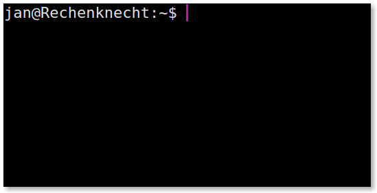
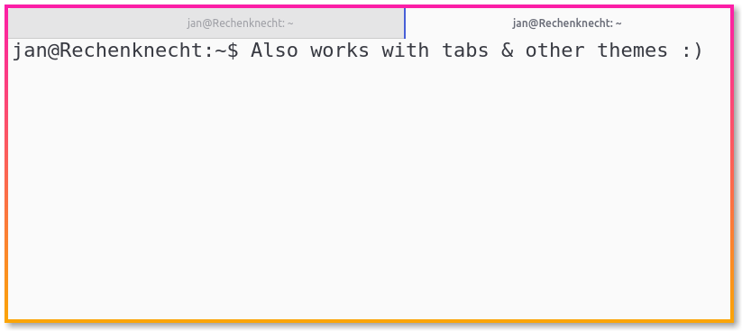

# [hyperminimal](https://www.npmjs.com/package/hyperminimal)

**Removes the window header from [Hyper terminal](https://hyper.is) for more space and less distraction.**

Before & after, minimal & clean interface:

Also works nicely with tabs, as it only removes the extra title bar:

If you like the extension, please [retweet & like](https://twitter.com/jancborchardt/status/809756895686823936) ❤️ :)

## How to use

Add `hyperminimal` to `plugins` in `~/.hyper.js`.

### Ubuntu & Elementary

To move the window, simply hold the Super/Windows key and drag it anywhere with the cursor.

### macOS

To move the window, hover over the edge of the window so the resize arrow appears, then drag _perpendicular_ to the direction of the resize arrow. For example, when hovering over the left or right edge, drag vertically instead of horizontally.

### Windows

To move the window, make sure Hyper has focus, press <kbd>Alt</kbd>+<kbd>Space</kbd>+<kbd>M</kbd>, then use the <kbd>&uarr;</kbd><kbd>&darr;</kbd><kbd>&larr;</kbd><kbd>&rarr;</kbd> keys to move the window and <kbd>Enter</kbd> to finalise the position.
After pressing an arrow key at least once, the window will also follow your mouse cursor (this is usually faster than holding down arrow keys).

## Other recommended plugins

- [hyper-dark-scrollbar](https://github.com/moso/hyper-dark-scrollbar)
- [hypercwd](https://github.com/hharnisc/hypercwd)
- [hyper-blink](https://github.com/amio/hyper-blink)
- [hyperterm-alternatescroll](https://github.com/lkzhao/hyperterm-alternatescroll)
- [hyperterm-one-light](https://github.com/andrepolischuk/hyper-one-light/)
- [hyperborder](https://github.com/webmatze/hyperborder)
